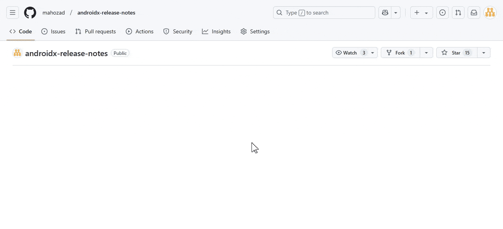

Image credit: [Android Developers]

This repository publishes [release notes] of [AndroidX (Jetpack) libraries].

You can subscribe to GitHub release notifications by selecting
*Watch* 🡲 *Custom* 🡲 *Releases*:

  <picture>
    <source media="(prefers-color-scheme: dark)" srcset="assets/how-to-subscribe-dark.gif">
    <source media="(prefers-color-scheme: light)" srcset="assets/how-to-subscribe-light.gif">
    
  </picture>

The Markdown, HTML, and plain text version of the release notes can be downloaded
in the *Assets* section at the bottom of the GitHub release page.

You can find the [original AndroidX GitHub repository here] (and [its AOSP source here]).  
See the file *[generateReleaseNotes.py]* for how the release notes are generated (deleted in commit [`bd0e7d3`](https://github.com/androidx/androidx/commit/bd0e7d36a49e83974c9cca55044dd84d5779fd93); see [this](https://github.com/androidx/androidx/blob/1cba44b5b1d14aca5441452374fb809c7d1044e8/buildSrc/public/src/main/kotlin/androidx/build/BuildServerConfiguration.kt#L96)).

### Similar repositories and apps:
  - [Now in Android]: Official application from Android's team; keep up-to-date with the world of Android
  - [Jetpack Release Tracker]: An application to track latest AndroidX library releases
  - [Separate release notes for each library]: It seems to be discontinued

[Android Developers]: https://developer.android.com/jetpack
[release notes]: https://developer.android.com/jetpack/androidx/versions/all-channel
[AndroidX (Jetpack) libraries]: https://developer.android.com/jetpack/androidx/versions
[original AndroidX GitHub repository here]: https://github.com/androidx/androidx
[its AOSP source here]: https://android.googlesource.com/platform/frameworks/support/
[generateReleaseNotes.py]: https://github.com/androidx/androidx/blob/859aae63bdb92645d03acdc741a2edafb0c6ce5d/development/release-notes/generateReleaseNotes.py
[Now in Android]: https://github.com/android/nowinandroid
[Jetpack Release Tracker]: https://github.com/lmj0011/jetpack-release-tracker
[Separate release notes for each library]: https://github.com/androidx-releases
